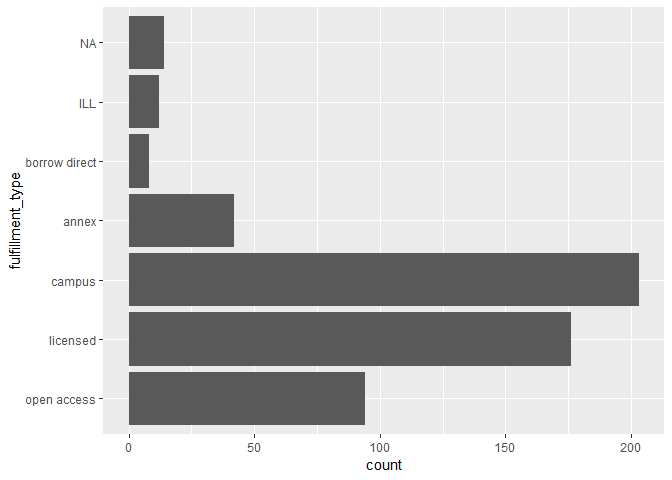
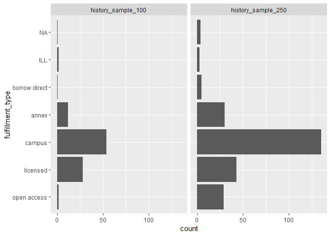
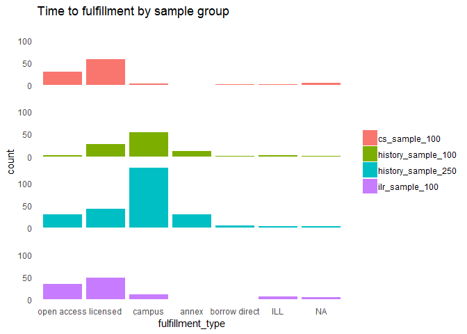
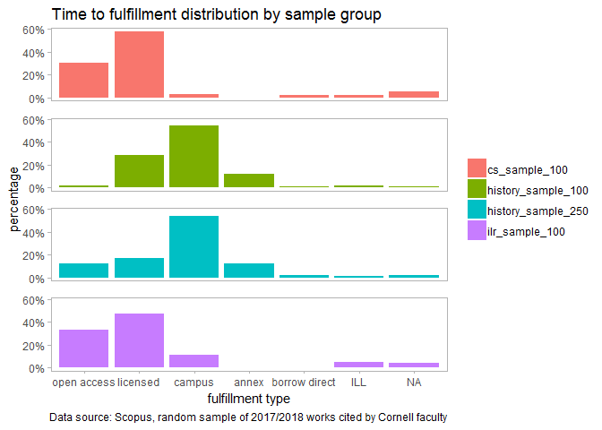

```
## Warning: package 'tidyverse' was built under R version 3.3.1
```

```
## Loading tidyverse: ggplot2
## Loading tidyverse: tibble
## Loading tidyverse: tidyr
## Loading tidyverse: readr
## Loading tidyverse: purrr
## Loading tidyverse: dplyr
```

```
## Warning: package 'tibble' was built under R version 3.3.3
```

```
## Warning: package 'tidyr' was built under R version 3.3.3
```

```
## Warning: package 'readr' was built under R version 3.3.1
```

```
## Warning: package 'purrr' was built under R version 3.3.3
```

```
## Warning: package 'dplyr' was built under R version 3.3.3
```

```
## Conflicts with tidy packages ----------------------------------------------
```

```
## filter(): dplyr, stats
## lag():    dplyr, stats
```

```
## Warning: package 'readxl' was built under R version 3.3.2
```

```
## Warning: package 'forcats' was built under R version 3.3.1
```


```
##  [1] "fulfillment_type"  "Authors"           "Author(s) ID"     
##  [4] "Title"             "Year"              "Source title"     
##  [7] "Volume"            "Issue"             "Art. No."         
## [10] "Page start"        "Page end"          "Page count"       
## [13] "Cited by"          "DOI"               "Link"             
## [16] "Document Type"     "Publication Stage" "Access Type"      
## [19] "Source"            "EID"               ""                 
## [22] ""                  ""                  ""                 
## [25] ""
```

```
## Warning: package 'bindrcpp' was built under R version 3.3.3
```

```
## Warning in read_xlsx_(path, sheet, col_names = col_names, col_types =
## col_types, : [224, 11]: expecting numeric: got '232+339'
```

```
## Parsed with column specification:
## cols(
##   .default = col_character(),
##   year = col_integer(),
##   page_start = col_integer(),
##   page_end = col_integer(),
##   cited_by = col_integer()
## )
```

```
## See spec(...) for full column specifications.
```

```
## Warning in remove(df): object 'df' not found
```

```
## # A tibble: 7 x 2
##   fulfillment_type     n
##   <fct>            <int>
## 1 open access         94
## 2 licensed           176
## 3 campus             203
## 4 annex               42
## 5 borrow direct        8
## 6 ILL                 12
## 7 NA                  14
```


<!-- -->

<!-- -->


<!-- -->

<!-- -->

